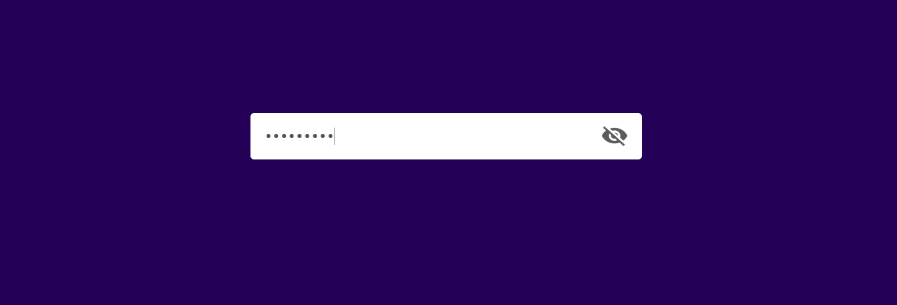

# 🔐 Show / Hide Password Toggle

A modern and responsive password visibility toggle web application built using HTML, CSS, and JavaScript. It allows users to easily switch between hidden and visible password states with an interactive eye icon, improving usability and user experience.

---

## 🚀 Features

* ✅ Toggle password visibility (Show/Hide)
* ✅ Interactive eye icon switch
* ✅ Clean and minimal UI design
* ✅ Responsive input field layout
* ✅ Lightweight and fast
* ✅ Beginner-friendly project

---

## 🛠️ Technologies Used

* 👉🏻 HTML5 – Structure  
* 👉🏻 CSS3 – Styling & Layout  
* 👉🏻 JavaScript (ES6) – DOM Manipulation & Logic  

---

## 📂 Project Structure

show-hide-password/  
│── index.html  
│── style.css  
│── script.js  
│── eye-open.png  
│── eye-close.png  

---

## ⚙️ How It Works

* 1️⃣ User clicks the eye icon  
* 2️⃣ JavaScript checks input type  
* 3️⃣ If hidden → converts to visible (`text`)  
* 4️⃣ If visible → converts to hidden (`password`)  
* 5️⃣ Icon updates accordingly  

---

## 📸 Preview

Example:  
  
  
 

---

## 🎨 UI & Interaction Details

* Uses simple and clean input design  
* Eye icon positioned using flexbox  
* Cursor pointer for better interactivity  
* Instant toggle without page reload  

---

## 🧪 Behavior Handling

* 1. Password is hidden by default  
* 2. Clicking icon reveals password  
* 3. Clicking again hides password  
* 4. Icon updates dynamically  

---

## 🌐 Live Demo

👉🏻 https://suraj-charan-dev.github.io/password-visibility-toggle/

---

## 🤝 Contributing

Contributions are welcome!

Feel free to fork this repository and submit a pull request.
